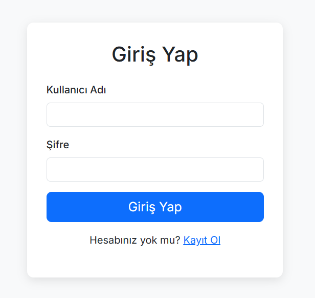
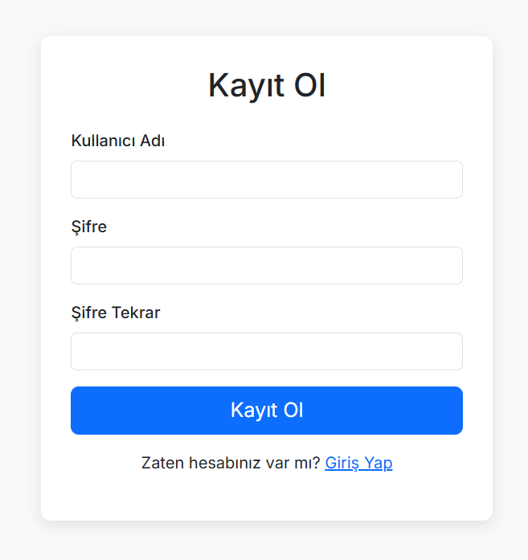
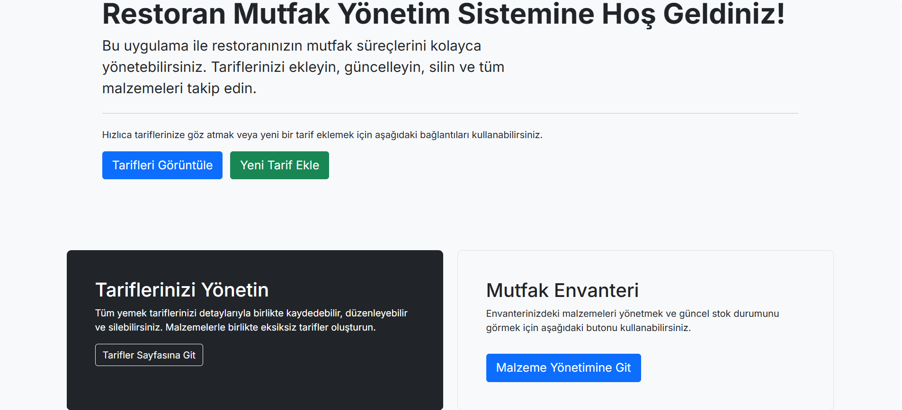
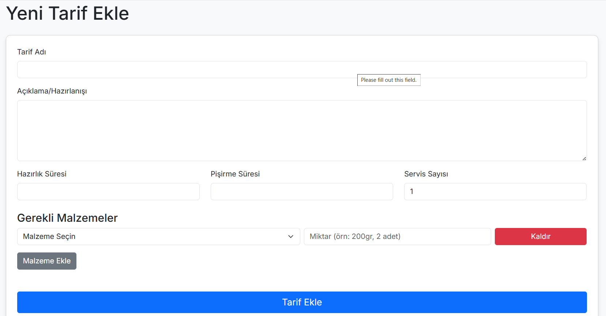
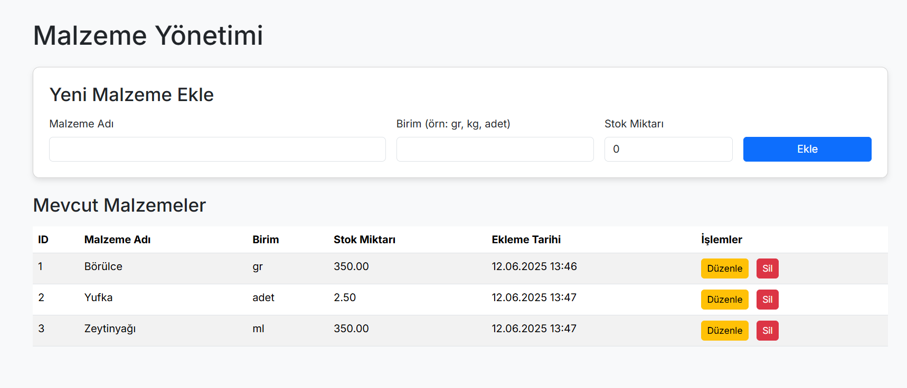
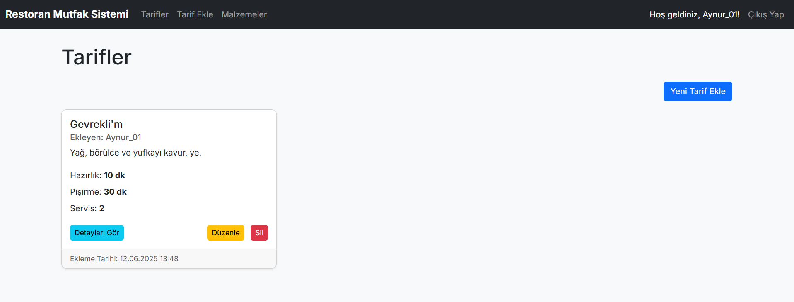

# PHP-MySQL_Projesi

# 🍽️ Restoran Yönetim Sistemi

Bu proje, **PHP**, **MySQL** ve **Bootstrap** kullanılarak geliştirilmiş basit bir restoran yönetim sistemidir. Restoranların tariflerini ve malzeme envanterini kolayca yönetmelerine olanak tanır.

---

## 🌐 Canlı Demo

Projeyi canlı olarak denemek için aşağıdaki bağlantıya tıklayabilirsiniz:

🔗 [http://95.130.171.20/~st22360859008/restoran_yonetimi/public/](http://95.130.171.20/~st22360859008/restoran_yonetimi/public/)

---

## 📹 Proje Tanıtım Videosu

Projenin genel işleyişini gösteren video tanıtımına buradan ulaşabilirsiniz:

## Proje Tanıtım Videosu

📽 [YouTube'da İzle](http://youtube.com/watch?v=Z2BSvFMmRYw)

---

## 🚀 Özellikler

### 👤 Kullanıcı Yönetimi
- Yeni kullanıcı kaydı
- Güvenli kullanıcı girişi ve çıkışı

### 🧂 Malzeme Yönetimi
- Malzeme ekleme, düzenleme ve silme
- Malzeme listesini görüntüleme
- Stok miktarlarını manuel ve tarif tüketimine bağlı olarak takip edebilme

### 📋 Tarif Yönetimi
- Tarif ekleme (hazırlık süresi, pişirme süresi, servis sayısı, malzemeler)
- Tarif görüntüleme, düzenleme ve silme
- Tariflere birden fazla malzeme ekleyebilme
- Tarif tüketildiğinde ilgili malzemelerin stoktan otomatik düşürülmesi

### 📦 Envanter Takibi
- Stok miktarlarını gösteren malzeme listesi
- Tarif tüketimiyle entegre stok düşüşü

---

## 🖼️ Ekran Görüntüleri

### 📌 Giriş Ekranı 


### 📌 Kayıt Ekranı 


### 📌 Ana Sayfa / Dashboard


### 📌 Tarif Ekleme


### 📌 Malzeme Yönetimi(Ekle, Düzenle, Sil)


### 📌 Tarif Yönetimi(Detay görüntüle, Güncelle, Düzenle, Sil)

---

## 🛠️ Kurulum

### 1️⃣ Gereksinimler
- XAMPP / WAMP / MAMP
- PHP 7.4 veya üzeri
- MySQL veya MariaDB

### 2️⃣ Projeyi İndirme
```bash
git clone <proje_github_repo_adresi> restoran_yonetimi
```
> Alternatif olarak zip olarak indirip `htdocs/` klasörüne çıkarabilirsiniz.

### 3️⃣ Veritabanı Kurulumu
1. phpMyAdmin’e gidin (örn: `http://localhost/phpmyadmin`)
2. `restoran_yonetimi` adlı yeni bir veritabanı oluşturun
3. `sql/restoran_yonetimi.sql` dosyasındaki SQL sorgusunu çalıştırarak tabloları oluşturun

### 4️⃣ Veritabanı Bağlantı Ayarları
`config/database.php` dosyasını açın ve şu şekilde düzenleyin:

```php
<?php
// config/database.php
define('DB_HOST', 'localhost');
define('DB_NAME', 'restoran_yonetimi');
define('DB_USER', 'root');
define('DB_PASS', '');
```

### 5️⃣ Projeyi Çalıştırma
Apache ve MySQL sunucunuzu başlattıktan sonra tarayıcıdan şu adresi ziyaret edin:

[http://localhost/restoran_yonetimi/public/](http://localhost/restoran_yonetimi/public/)

---

## 🤝 Katkıda Bulunma

Projeye katkıda bulunmak isterseniz bir **pull request** gönderin veya bir **issue** açın.

---

## 🪪 Lisans

Bu proje **MIT Lisansı** ile lisanslanmıştır.
